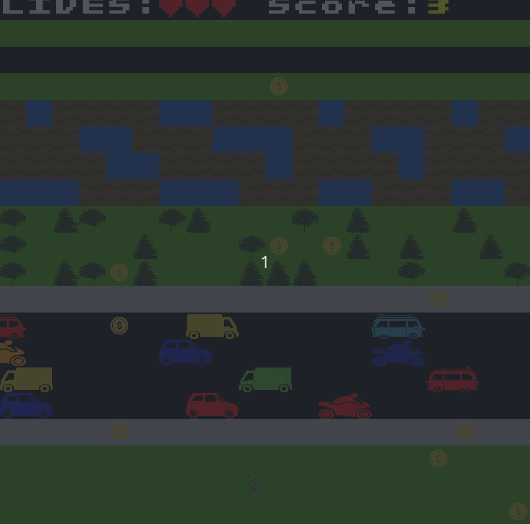

>**Project**
> 
>Course Unit: [Laboratório de Desenho e Teste de Software](https://sigarra.up.pt/feup/pt/ucurr_geral.ficha_uc_view?pv_ocorrencia_id=501676 "Software Design and Testing Laboratory"), 2nd year 
> 
>Course: **Informatics and Computer Engineering** 
> 
> Faculty: **FEUP** (Faculty of Engineering of the University of Porto)
> 
> Report: [Report.md](./docs/report.md)
> 
> Evaluation: **182**/200

The objective of this game is to move the frog through a path of static and moving obstacles, reaching the end of
the levels without dying with the highest score possible. 

The character is a frog that must cross a series of busy roads, rivers, train tracks and lava. He has 3 lives and every time he loses one, his position is reseted.

This game is based on a mix of two well-known games: Crossy Road and Frogger.

See [full report](./docs/report.md).

 

This project was developed by [Luís Jesus](https://github.com/lfsjesus) and [Miguel Rocha](https://github.com/r00cha).
